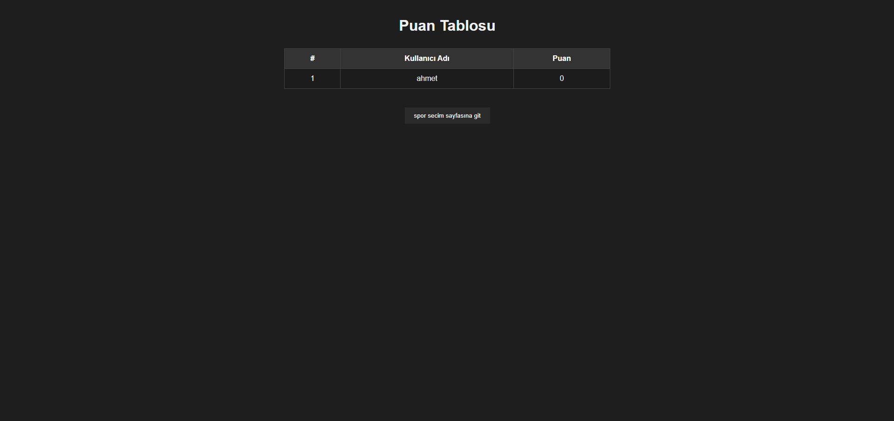

# JS Spor Bilgi Oyunu
Basit bir JavaScript tabanlı quiz uygulaması. Kullanıcıya rastgele 5 spor sorusu soruyor, doğru/yanlış cevapları sayıyor ve sonuç ekranı gösteriyor. 

# 🏁 Spor seçim sayfası

# Giriş sayfası

# ⚽ Futbol sayfası

# 🏀 Basketbol Sayfası

# 🏐 Voleybol sayfası 

# 🏅 Puan sayfası

